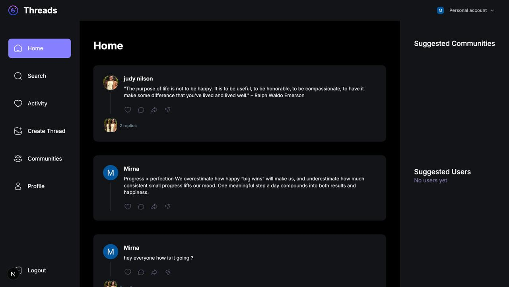
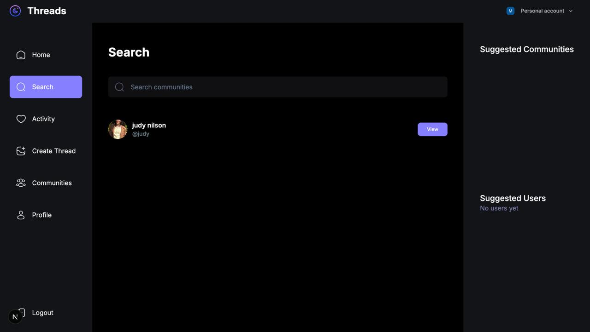
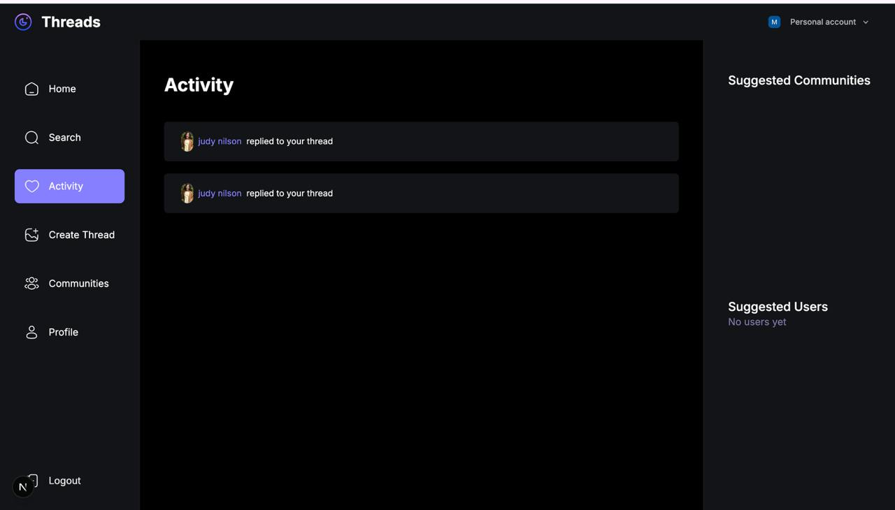
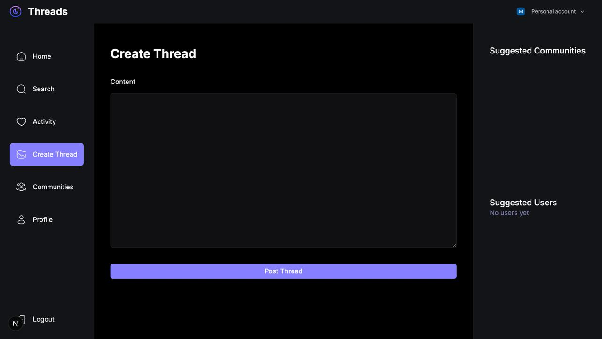
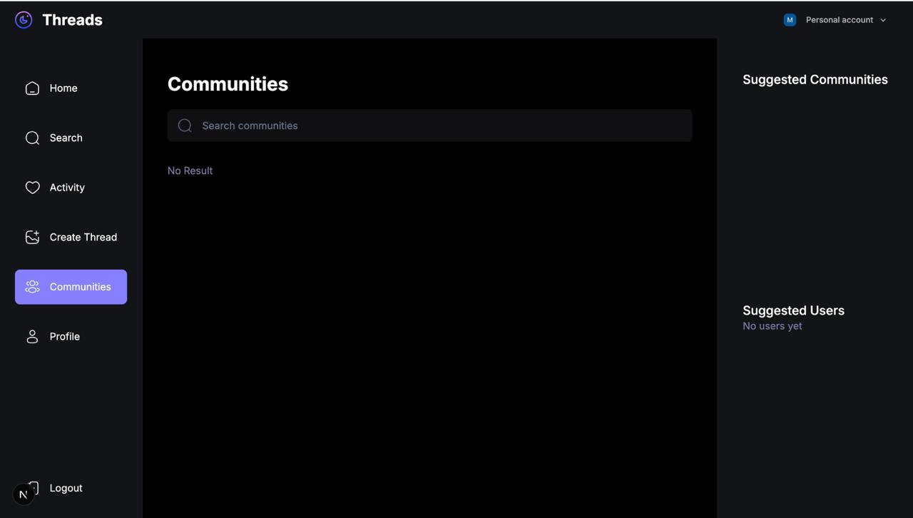
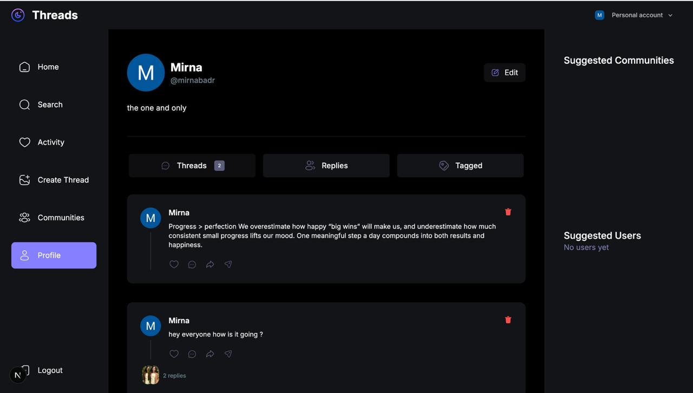

# 🧵 Threads App - Full-Stack Social Media Platform

A modern, full-featured social media application inspired by Meta's Threads, built with cutting-edge web technologies. This project showcases advanced full-stack development skills, including server-side rendering, real-time interactions, and scalable architecture.


## 🎯 Project Overview

Threads App is a comprehensive social media platform that enables users to create, share, and engage with threaded conversations. Built with modern web technologies, it demonstrates proficiency in full-stack development, database design, authentication, and user experience design.

### ✨ Key Features

- **🔐 Secure Authentication** - Powered by Clerk with seamless onboarding flow
- **💬 Thread Creation** - Create and share threaded posts with rich content
- **💭 Nested Comments** - Multi-level comment system with recursive thread support
- **👤 User Profiles** - Comprehensive profile management with customizable bios
- **🏘️ Communities** - Join and create communities for focused discussions
- **🔍 Advanced Search** - Search users and communities with real-time results
- **📱 Activity Feed** - Track replies and interactions on your threads
- **🎨 Modern UI/UX** - Beautiful dark mode interface with responsive design
- **📤 File Uploads** - Image uploads powered by UploadThing
- **⚡ Server Actions** - Optimized server-side data fetching and mutations

## 🛠️ Tech Stack

### Frontend
- **Next.js 16.1** - React framework with App Router
- **TypeScript** - Type-safe development
- **Tailwind CSS** - Utility-first CSS framework
- **Radix UI** - Accessible component primitives
- **React Hook Form** - Form state management
- **Zod** - Schema validation

### Backend
- **Next.js Server Actions** - Server-side data mutations
- **MongoDB** - NoSQL database
- **Mongoose** - MongoDB object modeling
- **Clerk** - Authentication and user management
- **UploadThing** - File upload service

### Development Tools
- **ESLint** - Code linting
- **PostCSS** - CSS processing
- **Git** - Version control

## 📸 Screenshots

### 🏠 Home Feed
The main feed displays all threads from users and communities you follow, with a clean, modern interface optimized for reading and engagement.


*The home page features a three-column layout with navigation sidebar, main content feed, and suggestions panel. Users can view threads, see replies, and interact with posts through likes, comments, and shares.*

### 🔍 Search Functionality
Powerful search capabilities allow users to find other users and communities quickly with real-time filtering.


*The search page enables users to discover new people and communities. Search results display user profiles with avatars, usernames, and quick view buttons for easy navigation.*

### 🔔 Activity Feed
Stay updated with all interactions on your threads through a dedicated activity feed.


*The activity page shows all replies and interactions on your threads, keeping you informed about engagement on your content. Each activity item displays the user who replied and links to the original thread.*

### ✍️ Create Thread
Intuitive thread creation interface with a clean, distraction-free design.


*The create thread page provides a simple, focused interface for composing new posts. The large text area and prominent post button make it easy to share thoughts and ideas.*

### 🏘️ Communities
Discover and join communities based on your interests.


*The communities page allows users to search and explore different communities. Each community card displays member count, description, and quick access to view details.*

### 👤 User Profile
Comprehensive profile pages with tabs for threads, replies, and tagged content.


*User profiles showcase all user content organized in tabs. Users can view their threads, replies, and tagged content. The profile includes edit functionality, bio, and engagement statistics.*

## 🚀 Getting Started

### Prerequisites

- Node.js 18+ installed
- MongoDB database (local or Atlas)
- Clerk account for authentication
- UploadThing account for file uploads

### Installation

1. **Clone the repository**
   ```bash
   git clone https://github.com/mirnabadr/threads_app.git
   cd threads_app
   ```

2. **Install dependencies**
   ```bash
   npm install
   ```

3. **Set up environment variables**
   Create a `.env.local` file in the root directory:
   ```env
   MONGODB_URI=your_mongodb_connection_string
   NEXT_PUBLIC_CLERK_PUBLISHABLE_KEY=your_clerk_publishable_key
   CLERK_SECRET_KEY=your_clerk_secret_key
   NEXT_PUBLIC_CLERK_SIGN_IN_URL=/sign-in
   NEXT_PUBLIC_CLERK_SIGN_UP_URL=/sign-up
   NEXT_PUBLIC_CLERK_AFTER_SIGN_IN_URL=/
   NEXT_PUBLIC_CLERK_AFTER_SIGN_UP_URL=/onboarding
   UPLOADTHING_SECRET=your_uploadthing_secret
   UPLOADTHING_APP_ID=your_uploadthing_app_id
   ```

4. **Run the development server**
   ```bash
   npm run dev
   ```

5. **Open your browser**
   Navigate to [http://localhost:3000](http://localhost:3000)

## 📁 Project Structure

```
threads_app/
├── app/                    # Next.js App Router pages
│   ├── (auth)/            # Authentication routes
│   ├── (root)/            # Protected routes
│   ├── api/               # API routes
│   └── globals.css        # Global styles
├── components/            # React components
│   ├── cards/             # Card components
│   ├── forms/             # Form components
│   ├── shared/            # Shared UI components
│   └── ui/                # Reusable UI primitives
├── lib/                   # Utility functions
│   ├── actions/           # Server actions
│   ├── models/            # Mongoose models
│   ├── validations/       # Zod schemas
│   └── utils.ts           # Helper functions
├── public/                # Static assets
└── constants/             # App constants
```

## 🎓 Skills Demonstrated

### Full-Stack Development
- **Server-Side Rendering (SSR)** - Optimized page loads with Next.js App Router
- **Server Actions** - Type-safe server-side mutations
- **API Route Design** - RESTful API endpoints for webhooks and file uploads
- **Database Design** - Efficient MongoDB schema with proper relationships

### Frontend Excellence
- **Component Architecture** - Reusable, maintainable React components
- **State Management** - Efficient client and server state handling
- **Form Handling** - Complex forms with validation using React Hook Form and Zod
- **Responsive Design** - Mobile-first approach with Tailwind CSS

### Backend Expertise
- **Database Operations** - Complex queries with Mongoose including population and aggregation
- **Authentication & Authorization** - Secure user management with Clerk
- **File Uploads** - Image handling with UploadThing
- **Data Validation** - Server-side validation with Zod schemas

### Best Practices
- **Type Safety** - Full TypeScript implementation
- **Code Organization** - Clean architecture with separation of concerns
- **Error Handling** - Comprehensive error handling and user feedback
- **Performance Optimization** - Efficient data fetching and caching strategies

## 🔐 Authentication Flow

1. **Sign Up/Sign In** - Users authenticate via Clerk
2. **Onboarding** - New users complete profile setup
3. **Session Management** - Secure session handling with middleware
4. **Protected Routes** - Route protection based on authentication status

## 📊 Database Schema

### User Model
- User profile information
- Thread references
- Community memberships
- Onboarding status

### Thread Model
- Thread content and metadata
- Author reference
- Community reference (optional)
- Parent-child relationships for nested comments

### Community Model
- Community information
- Member management
- Thread associations

## 🚢 Deployment

This application can be deployed on:
- **Vercel** (recommended for Next.js)
- **Netlify**
- **AWS Amplify**
- Any Node.js hosting platform

Make sure to configure all environment variables in your hosting platform.

## 🤝 Contributing

Contributions are welcome! Please feel free to submit a Pull Request.

## 📝 License

This project is open source and available under the [MIT License](LICENSE).

## 👨‍💻 Developer

**Mirna Badr**

- GitHub: [@mirnabadr](https://github.com/mirnabadr)
- Project Repository: [threads_app](https://github.com/mirnabadr/threads_app)

## 🎯 Future Enhancements

- [ ] Real-time notifications
- [ ] Direct messaging
- [ ] Thread sharing and reposting
- [ ] Advanced filtering and sorting
- [ ] Media attachments in threads
- [ ] User mentions and tags
- [ ] Analytics dashboard
- [ ] Mobile app version

---

**Built with ❤️ using Next.js, TypeScript, and MongoDB**

*This project demonstrates production-ready full-stack development skills and modern web application architecture.*
